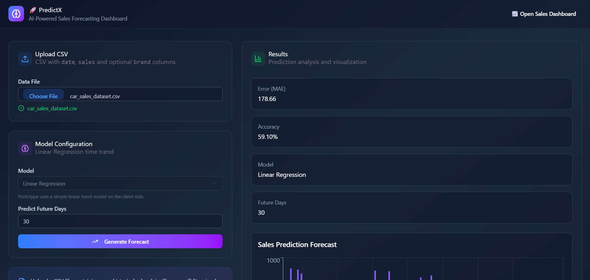
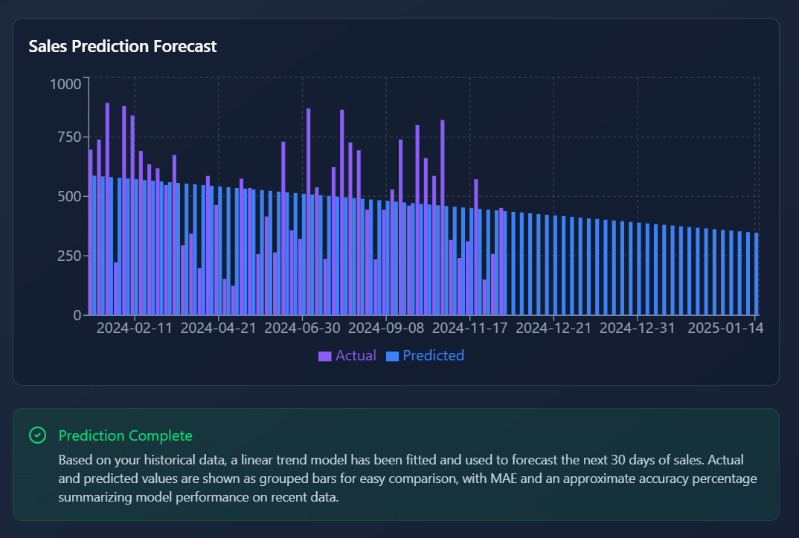
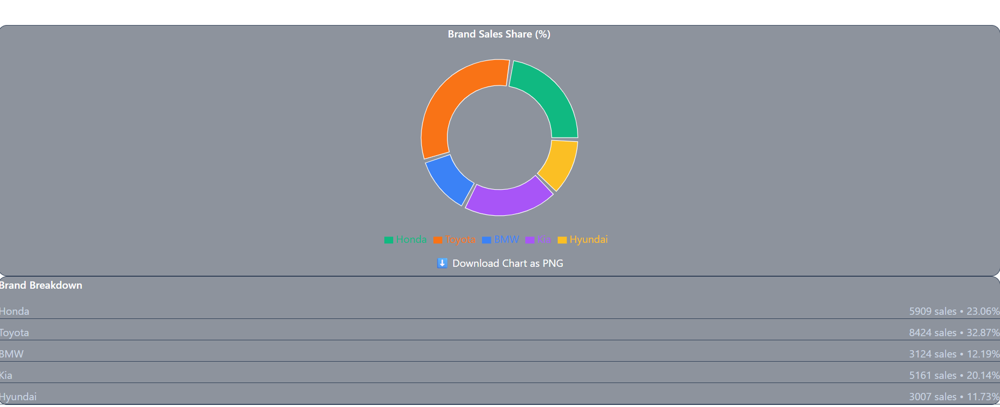

# 🚀 PredictX – AI Sales Forecasting Dashboard

PredictX is a modern **AI-powered sales forecasting dashboard** that predicts future sales trends using **Linear Regression** and visualizes results with interactive charts.

The application allows users to upload historical sales data in **CSV format**, train a simple machine learning model, and generate forecasts with clear analytics and visual insights.

---

# ✨ Features

📂 Upload CSV dataset with historical sales data
📈 Predict future sales using **Linear Regression**
📊 Interactive data visualization using charts
📉 Model evaluation with **MAE (Mean Absolute Error)**
📋 Analytics dashboard for brand sales breakdown
⚡ Fast client-side processing (no backend required)

---

# 🧠 Machine Learning Approach

PredictX uses a **Linear Regression time-trend model** to forecast sales.

Workflow:

1. Upload historical sales CSV
2. Parse and validate the dataset
3. Convert dates into a numerical time index
4. Train a Linear Regression model
5. Generate predictions for future days
6. Evaluate model performance

Model metrics include:

* Mean Absolute Error (MAE)
* Approximate prediction accuracy

---

# 📊 Dashboard Analytics

The application provides multiple insights:

• Sales forecast visualization
• Historical vs predicted comparison
• Brand sales distribution
• Sales share percentage by brand

Charts are powered by **Recharts** for smooth and interactive visualization.

---

# 🛠 Tech Stack

### Frontend

* React
* TypeScript
* Vite

### UI / Styling

* Tailwind CSS
* Radix UI
* Lucide Icons

### Data Visualization

* Recharts

### Routing

* React Router

### Utilities

* React Hook Form
* Class Variance Authority
* Tailwind Merge

---

# 📂 Project Structure

```
predictx
│
├─ src
│   ├─ pages
│   │   └── CarDashboard.tsx
│   │
│   ├─ components
│   │   └── ui
│   │
│   ├─ App.tsx
│   ├─ main.tsx
│   └─ index.css
│
├─ package.json
├─ vite.config.ts
└─ index.html
```

---

# ⚙️ Installation

Clone the repository

```
git clone https://github.com/diyuworks/predictx.git
```

Go to the project directory

```
cd predictx
```

Install dependencies

```
npm install
```

Run the development server

```
npm run dev
```

Open in browser

```
http://localhost:5173
```

---

# 📄 Example CSV Format

The dataset must include:

```
date,sales,brand
```

Example:

```
2024-01-01,120,Toyota
2024-01-02,140,Toyota
2024-01-03,135,Honda
```

---

# 📸 Screenshots

(Add screenshots here after uploading them to the repository)

Example sections:

### Dashboard



### Prediction Chart



### Results Panel



---

# 🔮 Future Improvements

• Add advanced ML models (Random Forest / ARIMA)
• Deploy live web application
• Export predictions as downloadable reports
• Add authentication system
• Improve forecasting accuracy

---

# 👩‍💻 Author

Diya Malviya
Computer Science Student | AI & Full Stack Enthusiast

GitHub
https://github.com/diyuworks

---

⭐ If you like this project, consider giving it a star!

  
